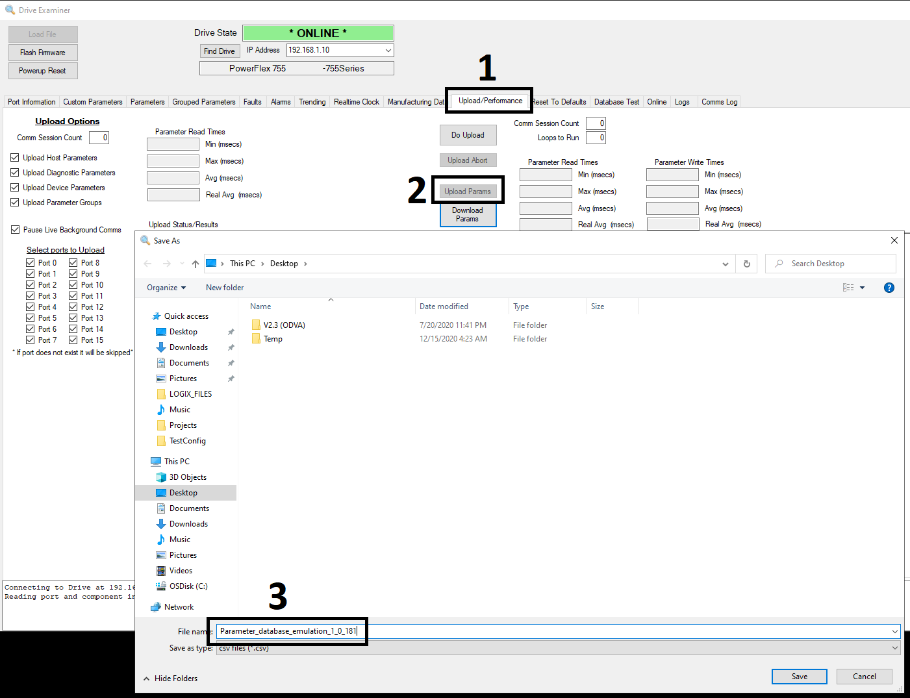
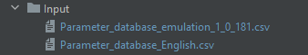

# DBASE_009 - Database Parameter Test
This script was created to be used with elegant emulation.

Before execution, please follow instruction below.

### Requirements
* Python 2.7 installed
* Pycharm environment installed and configured
* Pandas library installed
* Parameter database downloaded from the DUT and stored in the Input folder

### Pandas library instalation
Open Pycharm and type in the Terminal tab the following command:
```bash
pip install pandas
```

### Parameter database download using DriveExaminer



Based on the image above:
1) Go to the Upload/Performance tab.
2) Click on Upload Params button.
3) When Browse dialog will open, type the name of target file (eg. Parameter_database_emulation_xxx where xxx is 
the build number.

### Required changes in project folder

First of all target file needs to be changed in the Input folder.

In Input folder which is located in the project folder, there are two csv files.



**Parameter_database_English.csv** - this file is the source file which is used as a base of parameters to compare with.
This file shouldn't be edited.

**Parameter_database_emulation_xxx.csv** - this file needs to be replaced with before downloaded parameter database from
DUT.

### Required changes in script

If new target file is used, line 147 in the DBASE_009_Rhino.py script needs to be changed. Change this line accordingly
to the name of target file located in the Input folder.
```python
# Path of the target parameter database. This must be edited based on the current file name.
emulated_rhino_file_name = 'Input\\Parameter_database_emulation_1_0_181.csv'
```

### Optional changes in script

Lines from 151 to 160 can be changed when required. You can add or remove columns which will be taken into account in 
the comparison process. If adding column name then this column must exists in the csv file.

```python
# Columns that we want to import from csv files. If needed, cols can be added to the list and it will be taken
# into account in the comparison
columns_to_import = ['Port Number',
                     'Parameter Number',
                     'Parameter Name',
                     'Parameter Max Value',
                     'Parameter Min Value',
                     'Parameter Default Value',
                     'Parameter Unit',
                     'Parameter Writable',
                     'Value Does Not Default']
```

If needed, line 171 can be uncommented. This will allow you to save results separately to the excel files.
```python
#SaveComparisonInExcelFiles(rhino_params, emulated_rhino_params, compared_df)
```

### Results
* If the length of two csv files is different, then Output folder will be created and in the Result.txt will be 
information about this and at the same time, the same information will be provided in the pycharm console. 

```bash
Traceback (most recent call last):
  File "C:/GitPython/mentoring/Rhino Parameters Comparison/DBASE_009_Rhino.py", line 166, in <module>
    compared_df = CompareDataframes(rhino_params, emulated_rhino_params, columns_to_import)
  File "C:/GitPython/mentoring/Rhino Parameters Comparison/DBASE_009_Rhino.py", line 48, in CompareDataframes
    raise ValueError
ValueError
Tables have different length! Comparison aborted.

Process finished with exit code 1
```

* If there wont be any difference between files then as the result in the Output folder will be generated Result.txt 
file with information that files are the same based on the certain columns.

* If there will be any difference, then:
    * Result.txt file will be created in the Output folder with all differences found.
    * Separate (based on column name) excel files will be created with all differences found.